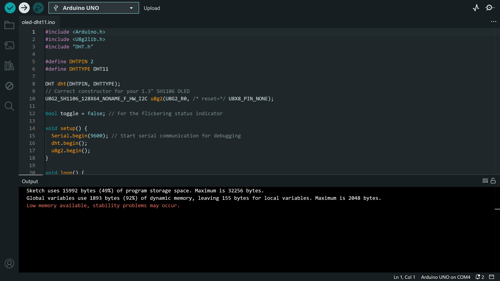

# Environmental Monitoring System

A multi-phase embedded systems project featuring a real-time environmental monitor and automated response system. Developed using an **Arduino Uno**, **DHT11 sensor**, and a **1.3" OLED display (SH1106)**, this build integrates live data visualization with automated hardware alerts.

The project evolved progressively across two development phases:

- **Phase 1:** Establishing sensor integration and real-time data display via the OLED.
- **Phase 2:** Transforming the project into a responsive environmental monitoring system with automated alert logic.

This repository documents the complete engineering process, from hardware interfacing and memory optimization to system multitasking and responsive embedded behaviour.

---

# Live Demo

See the final results here:  
[View Demo on X](https://x.com/emekabuilds_/status/2050583625188429927?s=46)

---

# System Overview

The system continuously monitors:
- Temperature
- Humidity

Environmental data is:
1. Acquired from the DHT11 sensor
2. Processed by the Arduino Uno
3. Displayed live on the OLED dashboard
4. Evaluated against programmed safety thresholds

When unsafe environmental conditions are detected, the system immediately activates:
- Visual alerts (RGB LED)
- Audio alerts (Active Buzzer)
- Real-time warning indicators on the OLED display

---

# Development Phases

## Phase 1: Sensor Integration & OLED Visualization

The goal of Phase 1 was to establish stable communication between the hardware components and build a reliable live monitoring dashboard.

This phase focused on:
- Reading environmental data from the DHT11 sensor
- Displaying live values on the OLED
- Establishing stable I2C communication
- Understanding Arduino Uno memory limitations
- Optimizing rendering performance for low-memory hardware

---

## Phase 1 Features

### Live Environmental Monitoring
The OLED continuously displays:
- Temperature readings
- Humidity readings

### Optimized Refresh Timing
- **Refresh Rate:** 2 seconds  
- Specifically tuned to match the physical sampling limitations of the DHT11 sensor.

### I2C Communication
The OLED communicates using:
- **SDA**
- **SCL**

This provides a clean two-wire communication interface between the Arduino and display.

---

## Phase 1 — Memory Optimization

### Initial Problem



*Figure 1: Arduino IDE warning showing critical RAM usage before optimization.*

The original implementation caused:
- **92% SRAM usage**
- System instability risks on the Arduino Uno

The issue was caused by full-frame OLED buffering.

---

## Solution — Page Buffer Rendering

To reduce memory usage, the rendering architecture was redesigned using **Page Buffer Mode**.

Instead of storing the entire display frame in memory, the OLED renders incrementally in smaller horizontal sections.

### Source Code Snippet

```cpp
u8g2.firstPage();
do {
  // Rendering logic here
} while (u8g2.nextPage());
```

This significantly reduced SRAM usage and stabilized the system.

---

## Phase 1 Components

- **Microcontroller:** Arduino Uno Rev3
- **Display:** 1.3" OLED Display (SH1106 Driver)
- **Sensor:** DHT11 Temperature & Humidity Sensor
- **Prototyping:** 830-point Breadboard & Jumper Wires

---

## Phase 1 Wiring


*Figure 2: Phase 1 prototype showing live environmental monitoring.*

---

# Phase 2 — Responsive Environmental Safety System

In Phase 2, the project evolved beyond simply displaying numbers.

The goal shifted toward building a responsive embedded system capable of reacting intelligently to environmental conditions in real time.

This phase introduced:
- Automated danger alerts
- Real-time response logic
- Multitasking using non-blocking code
- Intelligent OLED dashboard feedback
- Audio and visual environmental warnings

---

# Phase 2 Features

## 1. Danger Alert System

The system was programmed to behave like a miniature environmental safety monitor.

### Visual Alert Logic
An RGB module was added to the system.

#### Safe Conditions
- RGB LED remains **Solid Green**
- OLED displays system data and a **"SYSTEM STATUS: OK"** note.

#### Unsafe Conditions
When environmental thresholds are exceeded:
- The green LED immediately turns OFF
- The red LED begins flashing

This creates a highly visible warning state.

---

### Audio Alert Logic

An **Active Buzzer** was synchronized with the red warning LED.

#### Alert Behaviour
- Pulses every **150ms**
- Produces a rapid "staccato" warning effect
- Creates an urgent alarm-style feedback system

---

## 2. Intelligent OLED Dashboard

Instead of replacing the display with a generic `"ERROR"` message, the dashboard remains fully informative during alerts by displaying text such as **"TEMP TOO HIGH!"**.

### Dashboard Behaviour
- Live temperature and humidity values remain visible
- A high-contrast inverted warning bar appears at the bottom of the OLED

This allows:
- Real-time observation of sensor behaviour
- Immediate identification of the triggering value
- Monitoring of values as they return to safe ranges

---

# Technical Optimizations

# Non-Blocking Multitasking Using `millis()`

The biggest challenge I faced in Phase 2 was handling multiple tasks simultaneously.

Using `delay()` caused major problems:
- OLED updates would freeze
- Sensor polling would pause
- The system became unresponsive during alarm activity

To solve this, the system was redesigned using **non-blocking timing logic with `millis()`**.

### Source Code Snippet

```cpp
// Non-blocking pulse logic for the Danger Alarm
if (isAlarmActive) {
  unsigned long currentMillis = millis();
  
  if (currentMillis - prevAlarmMillis >= 150) { // 150ms pulse interval
    prevAlarmMillis = currentMillis;
    alarmToggle = !alarmToggle; 
    
    // Toggle Buzzer and Red LED simultaneously
    digitalWrite(BUZZER_PIN, alarmToggle);
    setRGB(alarmToggle ? 255 : 0, 0, 0); 
  }
}
```
---

## Simultaneous Task Handling

The Arduino can now independently manage:

| Task | Timing |
|---|---|
| Buzzer and LED pulsing | Every 150ms |
| OLED refreshing | Continuous |
| Sensor polling | Every 2 seconds |

This creates smooth multitasking behaviour while keeping the system responsive at all times.

---

# Final System Architecture

The final system combines:
- Real-time sensing
- Embedded display rendering
- Audio feedback
- Visual warning logic
- Non-blocking multitasking
- Memory-optimized OLED rendering

The project evolved from a simple monitoring display into a responsive embedded environmental safety system.

---

# Components

- **Arduino Uno Rev3**
- **DHT11 Temperature & Humidity Sensor**
- **1.3" OLED Display (SH1106)**
- **RGB LED Module**
- **Active Buzzer**
- **830-point Breadboard**
- **Jumper Wires**

---

# Repository Structure

| Folder | Description |
|---|---|
| `/src` | Source code for each development phase |
| `/requirements` | Hardware and software requirements |
| `/assets` | Wiring photos, screenshots, and project media |
| `README.md` | Full project documentation |

---

# Possible Future Improvements

- Configurable threshold system
- Wireless monitoring
- IoT dashboard integration
- Data logging to an SD card
- Higher-accuracy environmental sensors
- Mobile notification support

---

# Author

Built and documented by **Chukwuemeka Ifeanyi**  
Mechatronics Engineering Student • May 2026

[@emekabuilds_](https://x.com/emekabuilds_)
